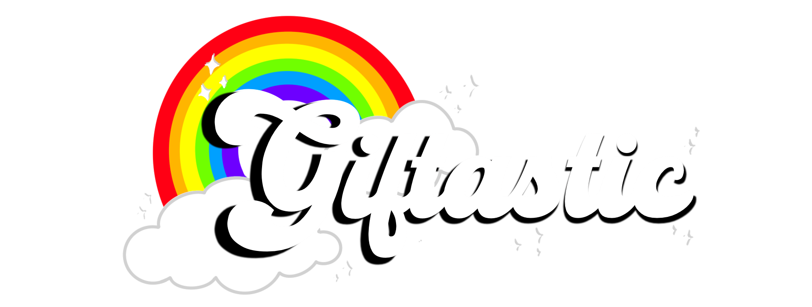

## Description

What is GIF-tastic? Picture this, if "we heart it" and "giphy" had a baby. A place where you could just go and like as many gifs as you wanted. A sea of gifs. YOUR sea of gifs. 


Now.. realistically you wouldn't make the sea to have "fun" but to pass time. You can like gifs and they will all be easily accessed via your profile.  


Cool right? Yeah...probably not but at least you'll be able to see a bunch of entertaining gifs. 👍🏻🤓

## Deployment Link 
[Deploy Server](https://project2deploy-omgvalicious.koyeb.app/)


## Installation

1. Fork and clone this repo then, using your terminal, install all dependencies : 
```
npm -install
```
1. In your terminal run: 
```
sequelize init
```
1. Now that you have initiallized sequelize (step 2) you can create the database(this project already has a database with exisiting models named: `express-auth-boilerplate`). Using your terminal run:
```
createdb express-auth-boilerplate
``` 
1. In terminal run the migrations:
```
sequelize db:migrate
```
1. Then populate your database run: 
```
sequelize db:seed:all 
```
You are all set to add some data. To use the API follow these steps listed below.


## API:
[](https://developers.giphy.com/)

click image to go to Giphy site to get an API key. 

### Using API key⚠:

- To use your api key you will need to `touch .env` file in your terminal.
- In your env file your API Key in this format: `API_KEY=' '` paste your API inside of the single quotes


## Technologies Used: 

- Sequelize - used for data in database and node.
- Node.js - for server to use Javascript for building application
- Express - webframe (RESTful Routes)
- EJS - website template
- Bootstrap - website styling(CSS Shortcuts)

## ERDs:


## RESTful Routes

| Method | Path | Purpose |
| ------ | -------------- | -------------------------------- |
| GET | `/` | home page that lists trending gifs |
| GET | `/gifs/search` | list gifs with tag user searched|
| GET | `/gifs/details/:id` | gif details for single gif|
| POST | `/gifs/details/:id` | will allow user to post a comment to gif displayed |
| POST | `/gifs/details/:id` | user can add gif to their likes in gif details|
| GET | `/users/profile` | shows profile with list of all liked gifs for user |
| POST | `/users/like` | stores like to currently signed in user|
| GET | `/users/edit` | edit username form |
| PUT | `/users/edit` | user will be able to update their username |
| DELETE | `/like` | allows user to unlike a gif |


## Wireframes 


## Non-User Story

- As a non-user i will have access to gifs library
- As a non-user i view gif details/comments
- As a non-user i will NOT be able to "like" gifs
- As a non-user i will NOT have the ability to leave any comments
- As a non-user i will NOT have a profile
- As a non-user i will be able create an account

## User Story

- As a User i will have access to the gif library
- As a User i will be able to view gif details/comments
- As a User i will be able to like gifs
- As a User i will be able to leave a comment on gifs
- As a User i will be able to login/view my profile

## MVP Goals

1. Make homepage display gifs
1. Have nav bar for user to access different routes
1. Existing users may click on gif icons to access their details 
1. Through details display the user may comment or add/remove gif to/from their faves
1. users profile displays all their faves 

## Stretch Goals

1. being able to categorize their faves 
1. being able to upload their own gifs 
1. user profile pic -- being gifs 

# Post-Project Reflection:
Since completing the project I believe I have started noticing the best way I work/learn. On my pervious project I recall being extremely anxious and trying to avoid coding until I believed I "grasped it" using youtube/lecture recordings. I was panicking so much that I kept myself from actually coding out of self-doubt. A few days prior to our presentation day, once I finally started coding, I found myself create lines of code off things I had memorized.


For this reason, this time around I decided to avoid tutorials until I had ran through all possible solutions I could think of myself. Actually using my brain power. I also made sure to ask for help when needed to avoid getting stuck on an issue by trying to "do it all myself". I believe by doing this it helped me to begin to memorize javascript syntax more and start to feel more comfortable with it. Another hurdle I faced was learning Bootstrap. I recall fighting with myself because I kept trying to give up and return to using CSS directly because of how much I wanted to customize my layout and go all out. Eventually I decided the better move was going to be to try bootstrap regardless of how unfamiliar I was with it. I gave up my website design in order to gain knowledge on a topic that I knew was gonna benefit me in the long run. 


Over all, I learned a lot from this project and although my design was more basic than I would have liked I'm still proud for challenging myself. I can't wait for the next one. 


### Sources
[NavBar Tutorial](https://youtu.be/4sosXZsdy-s)

